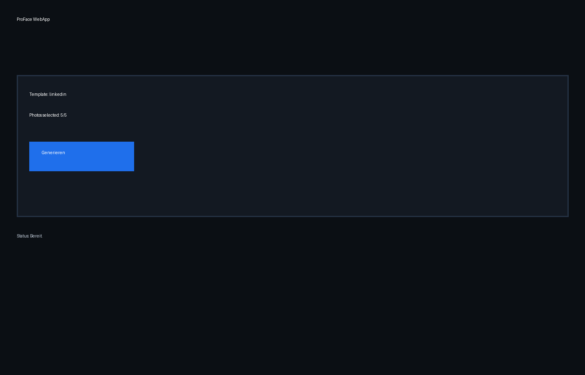
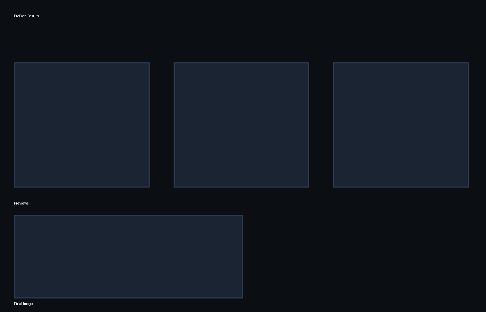

# ProFace-Studio

AI-powered Telegram Bot + WebApp that transforms up to 5 personal photos into professional business headshots.

## Features

- Enforces exactly 5 photo uploads per generation.
- Fixed style templates (no free-text prompts):
  - LinkedIn-Style
  - Creative Studio
- Two-phase AI pipeline on Replicate:
  - Nano Banana 2: fast previews (2-3 options)
  - Nano Banana Pro: final high-quality render
- Telegram Stars checkout (`XTR`) before final generation.
- Neon PostgreSQL persistence for users, uploads, and transactions.
- Railway-ready (`Procfile` + `requirements.txt`).
- WebApp (`Flask`) for template selection, photo upload, and preview/final result rendering.

## Project Structure

- `main.py` - Telegram bot flow and handlers.
- `database.py` - Neon/PostgreSQL connection and schema methods.
- `ai_pipeline.py` - Replicate wrapper and prompt templates.
- `web_app.py` - Flask WebApp server.
- `templates/index.html`, `static/*` - Web UI.
- `Procfile` - Railway worker command.
- `requirements.txt` - Python dependencies.
- `.env.example` - required environment variables.

## Environment Variables

Copy `.env.example` to `.env` and set:

- `TELEGRAM_TOKEN`
- `NEON_DATABASE_URL`
- `REPLICATE_API_TOKEN`
- `REPLICATE_PREVIEW_MODEL`
- `REPLICATE_FINAL_MODEL`
- `WEBAPP_URL` (optional, shown in bot `/start`)
- `PROFACE_PRICE_XTR` (default `49`)

## Run Locally

```bash
python -m venv .venv
# Windows
.venv\Scripts\activate
pip install -r requirements.txt
python main.py
```

Run WebApp:

```bash
python web_app.py
```

## WebApp Preview





## Database Tables (Neon)

Initialized automatically on startup:

- `users` - user profile + current stage + selected template
- `uploads` - temporary 5 photo file IDs
- `transactions` - Telegram Stars invoices/payment states

## Telegram Stars Notes

- Currency is `XTR` using `sendInvoice`.
- Final rendering starts only after:
  - `pre_checkout_query` is approved
  - `successful_payment` is received

## Validation

- Python syntax validation for bot/webapp modules (`py_compile`).
- End-to-end flow validated on code level:
  - template selection
  - exactly 5 uploads
  - paid-only final generation
  - preview-to-final handoff
